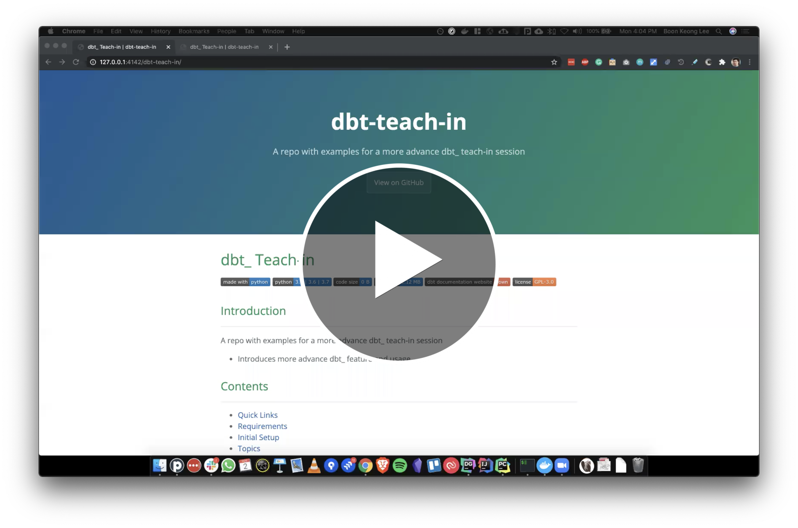

dbt_ Teach-in
============


[][1]


## Introduction
---------------
A repo with examples for a more advance dbt_ teach-in session
 - Introduces more advance dbt_ feature and usage

### Video Recording of Teach-in Session 
[][video-gdrive]


## Contents
-----------
 - [Quick Links](#quick-links)
 - [Requirements](#requirements)
 - [Initial Setup](#initial-setup)
 - [Topics](#topics)
    - [Seed](#seed)
    - [Test](#tests)
    - [Snapshots](#snapshots)
    - [Analyses](#analyses)
    - [Macros](#macros)
    - [Jinja](#jinja)
    - [Hooks](#hooks)
    - [Documentation](#documentation)
    - [Redshift Configurations](#redshift-configurations)
    - [Best Practices](#best-practices)


## Quick Links
--------------
Check out the [dbt_ documentation][1] website for this repo!

[1]:dbt_teach_in/docs/


## Requirements
---------------
1. A Database 
    - You may either use the Analytics Redshift; or
    - Spin up a local Postgres database instance (using docker)

2. Python 
    - Version 3.6 or above

3. Git
    - To clone this repository on Github
    
4. dbt_  

5. For other Python modules (if any), see:
    - [`requirements.txt`](requirements.txt)

## Initial Setup
--------
1. Prepare the Database
    - If you are using the Analytics Redshift, make sure to 
        - Set the [`profile.yml` in the dbt project](dbt_teach_in/profiles.yml) accordingly.
            - Set your `user` 
            - Set your `schema` 
            - Change the `target` to `redshift`
        - Export your password to the environment variable:
            ```bash
            export PASS='<your_password_here>'
            ```
            
    - If you want to run a local Postgres database instance, you will need to:
        - [Install Docker](https://docs.docker.com/docker-for-mac/install/)
        - Docker pull and run a local Postgres instance
            ```bash
            docker run --rm --name pg-docker -e POSTGRES_PASSWORD=docker -d -p 5432:5432 postgres
            ```
          _Tips: add `-v $HOME/docker/volumes/postgres:/var/lib/postgresql/data` to persist the database._
        - To stop the database when done, run:
            ```bash
            docker stop pg-docker
            ```

2. Installing Python
    - Follow the [guides to install Python][install-py-guide] if you don't 
      have it installed already.

3. Cloning this repository
    - If you haven't already, install Git (we recommend [installing via Homebrew][install-hb-guide])
    - Create a directory
      ```bash
      mkdir ~/github
      cd ~/github
      ``` 
    - Clone the repository
      ```bash
      git clone git@github.com:1bk/dbt-teach-in.git
      ``` 
      > _If you are having trouble with this, please reach out to me._
          

4. Installing dbt_
    - While there are many ways to install dbt_, we suggest to install it in a
      python virtual environment.
    - Follow [the official dbt_ guide][install-dbt-guide] that details each step:
        1. Create a local environment
           ```bash
           cd dbt-teach-in                     # set the working directory to the cloned repo
            
           python3 -m venv dbt-env             # create the environment
           source dbt-env/bin/activate         # activate the environment
           ```
        2. Install `dbt`
           ```bash
           pip install dbt
           ```

## Topics
---------
The topics here is shared in the order in which it was presented.

Note: 
 - Here we are applying dbt on a local Postgres instance.
 - Make sure to be in the dbt project directory
    ```bash
    cd ~/github/dbt-teach-in/dbt_teach_in
    ```
   
  
### Seed
> _Teach-in file reference:_
>   - [Raw data in `/data`](dbt_teach_in/data)
>   - [Documentation in `/data/seeds.yml`](dbt_teach_in/data/seeds.yml)
> 
> _Teach-in dbt\_ documentation reference:_
>   - [Table Documentation](dbt_teach_in/docs/#!/seed/seed.dbt_teach_in.raw_countries)
> 
> _Official dbt\_ docs:_
>   - [Seed -- Getting Started](https://docs.getdbt.com/docs/building-a-dbt-project/seeds/)
>   - [Seed configurations](https://docs.getdbt.com/reference/seed-configs)
>   - [Seed properties](https://docs.getdbt.com/reference/seed-properties)
>   - [`seed` command](https://docs.getdbt.com/reference/commands/seed)

1. Specify a schema to populate the seed files
    - In `dbt_project.yml`
        ```yaml
        seeds:
          dbt_teach_in:
            +schema: seeds
            quote_columns: true
        ```

2. Seed the data
    - Making sure the files you want to seed are in `/data`, run:
        ```bash
        dbt seed --profiles-dir ./
        ```

3. Setting custom columns
    - In `dbt_project.yml`
        ```yaml
        seeds:
          dbt_teach_in:
            ...
      
            raw_orders:
              # Override column types
              +column_types:
                order_priority: varchar(1)
        ```

4. Enable/Disable seed files:
     - In `dbt_project.yml`
        ```yaml
        seeds:
          dbt_teach_in:
            +schema: seeds

            ...

            snapshots:
              +schema: snapshots
        
              raw_orders_snapshot_backup:
                +enabled: true
        ```

5. Seeding specific files:
    - Using `--select`:
        ```bash 
        dbt seed --profiles-dir ./ --select raw_orders_snapshot_backup 
        ``` 

### Tests
> _Official dbt\_ docs:_
>   - [Tests](https://docs.getdbt.com/docs/building-a-dbt-project/tests/)

1. Schema Tests 
    1. Creating simple schema tests:
        - In the properties (e.g. `schema.yml` files), add `tests:`
        - For example, in [`/data/seeds.yml`](dbt_teach_in/data/seeds.yml) _(Yes, you can do it for seeds file)_:
            ```yaml
            seeds:
              - name: raw_orders
                description: ...
                columns:
                  - name: id
                    description: Integer ID of an order entry in this table.
                    tests:
                      - unique
                      - not_null
          
                  - name: order_priority
                    tests:
                      - accepted_values:
                          values: ["C", "H", "M", "L"]
          
                  ...
            ```
    1. Creating `relationships` tests between tables:
        - In the properties (e.g. `schema.yml` files), add `tests:`
        - For example, in [`/data/seeds.yml`](dbt_teach_in/data/seeds.yml):
            ```yaml
            seeds:
              - name: raw_orders
                description: ...
                columns:
                  ... 
          
                  - name: country_id
                    description: Integer ID of a country entry in the `raw_countries` table.
                    tests:
                      - relationships:
                          to: ref('raw_countries')
                          field: id
            
                  - name: item_type_id
                    description: Integer ID of an item type entry in the `raw_item_types` table.
                    tests:
                      - relationships:
                          to: ref('raw_item_types')
                          field: id
            ```

    1. Reusing tests using **anchors** in `yaml`:
        - For example, in [`/models/reporting/staging/reporting_staging.yml.yml`](dbt_teach_in/models/reporting/staging/reporting_staging.yml):
        - Define an anchor:
            ```yaml
            ##############################################
            ## Defining some anchor labels to stay DRY. ##
            ##############################################
            
            test__boolean_true_only: &test__boolean_true_only
              tests:
                - not_null
                - accepted_values:
                    values:
                      - true
            ```
        - Using the anchor:
            ```yaml
            models:
              - name: stg_orders__calc_check
                description: |
                  A simple view use to visualy check the reports v.s. calculated:
                    - Revenue
                    - Cost
                    - Profit
            
                  Schema test is executed on the Boolean column and throws error if
                  any calculation is off!
            
                columns:
                  - name: same_reveue
                    description: ""
                    <<: *test__boolean_true_only
            
                  - name: same_cost
                    description: ""
                    <<: *test__boolean_true_only
            
                  - name: same_profit
                    description: ""
                    <<: *test__boolean_true_only
            ```

    1. But note that Schema test only show if a test `PASS` or `FAILS`. To get the number of rows that
       fails a particular tests, you can use [Data Test](https://docs.getdbt.com/docs/building-a-dbt-project/tests/#data-tests) instead.

1. Data Tests
    1. Creating simple data test:
        - Create a query that would return rows for a specific conditions (in the `WHERE` clause). 
        - *If rows are returned, then the test will fail* and return an `ERROR` (default) or `WARN` (see below) 
        - Save the query in the [`/tests` directory](dbt_teach_in/tests)
        - See example [`test_stg_orders__calc_check.sql`](dbt_teach_in/tests/test_stg_orders__calc_check.sql)
    
    1. Defining custom config for each test:
        - By default, a test is `enabled` and the `severity` is **error**.
        - To overwrite this, define [custom config](https://docs.getdbt.com/reference/data-test-configs) in the test's `.sql` files:
            ```yaml
            {{ "{{
                config(
                    enabled=true | false,
                    severity='warn' | 'error'
                )
            " }}}}
            ```
        - See example [`test_stg_orders__calc_check.sql`](dbt_teach_in/tests/test_stg_orders__calc_check.sql)

    
### Snapshots

Use snapshot to track changes to a table overtime. 
You can also use it to view a snapshot of the table at a specific period in time. 

1. Create a snapshot
    1. Follow the [official dbt guide](https://docs.getdbt.com/docs/building-a-dbt-project/snapshots/)
    1. For example, see [`/snapshots/raw_orders_snapshot.sql`](dbt_teach_in/snapshots/raw_orders_snapshot.sql)

2. To revisit the table at a specific period in time
    1. In our example, there was an error in the "units_sold" in the `raw_orders` table where the number was
       doubled in the month of June 2017.
    1. We use a custom query to put ourselves at the point in time before or after the fix
       was executed (i.e. the fix was on '2017-07-01').
    1. For the custom query, see [`/analysis/tracing_units_sold_error.sql`](dbt_teach_in/analysis/tracing_units_sold_error.sql)
    1. [Documentation of the Query](dbt_teach_in/docs/#!/analysis/analysis.dbt_teach_in.tracing_units_sold_error)
    
### Analyses
> _Teach-in file reference:_
>   - [Documentation in `/analysis/analysis.yml`](dbt_teach_in/analysis/analysis.yml)
>   - [Documentation Docs in `/analysis/docs/analysis.md`](dbt_teach_in/analysis/docs/analysis.md)
> 
> _Teach-in dbt\_ documentation reference:_
>   - [Analysis Documentation](dbt_teach_in/docs/#!/analysis/analysis.dbt_teach_in.tracing_units_sold_error)
> 
> _Official dbt\_ docs:_
>   - [Analyses](https://docs.getdbt.com/docs/building-a-dbt-project/analyses/)

Basically, if you have a "analytical" queries that you want to version control and also run using dbt 
but *not materialise* the table, then you can dump them in the `/analysis` directory.

1. Remember, anything in the `/analysis` directory will not run when you execute `dbt run`. 
   Instead, it will only be compiled.
1. Compiling turns the queries in the `.sql` files to runnable sql you can copy & paste into 
   your SQL clients or Sisense (Periscope)
1. To compile manually, just run `dbt compile`.

### Jinja
> _Official dbt\_ docs:_
>   - [Using Jinja](https://docs.getdbt.com/tutorial/using-jinja/)

1. Setting variables in `dbt_project.yml`:
    - A simple example is to set the variable name `test_name` to `Bob`:   
        ```yaml
        vars:
          dbt_teach_in:
            test_name: "Bob"
        ```
    - This variable is available project wide.
    
1. Setting variables within `.sql` scripts
    - A simple example is to set the variable name `test_name` to `Bob`:   
        ```sql
        {{ " 
        ```
    - This variable is available only in this script.
    - We can even use Python modules within this jinja contexts:  
        - Here we set the variable called `now` to the python module datetime  
            ```sql
            {{ " 
            ```
        - This example is implemented in [`models/experiments/crazy_experiment.sql`](dbt_teach_in/models/experiments/crazy_experiment.sql)
    
1. Calling variables within `.sql` scripts.
    - Simply use the doubt curly brackets in `.sql` files, like this:
        ```sql
        {{ " {{ test_name "}}}}
        ```
    - For variables assign python modules, you can call its sub method, liek this:
        ```sql
        {{ " {{ now.minute "}}}}
        ```

1. Note that `ref` and `source` used are macros called using the jinja:
    - e.g.
        ```sql
        with source_table_name as (
        
            select * from {{ " {{ source('schema_name', 'table_name') "}}}}
        
        )
      
        , model_name as (
        
            select * from {{ " {{ ref('model_name') "}}}}
        
        )
        ```

### Hooks
There are multiple type of Hooks & Operations dbt can run, see the [official dbt documentation](https://docs.getdbt.com/docs/building-a-dbt-project/hooks-operations/)

1. Run Post-Hooks (i.e. after model is materialised)
    - Example:
        ```sql
        {{ " {{  
            config(
                materialized='table',
                post_hook=[ 
                  'drop table if exists dbt_experiment.crazy_experiment_fruit_only',
                  'create table dbt_experiment.crazy_experiment_fruit_only as (select * from dbt_experiment.crazy_experiment where item_type = ''Fruits'')',
                ]
            ) 
        "}}}}
        ```
 
### Macros
> _Official dbt\_ docs:_
>   - [Macros](https://docs.getdbt.com/docs/building-a-dbt-project/jinja-macros#macros)

### Documentation
> _Official dbt\_ docs:_
>   - [Documentation](https://docs.getdbt.com/docs/building-a-dbt-project/documentation/)

1. Formatting [YAML Multiline Strings](https://yaml-multiline.info/) in descriptions with “\>”, “\|”, etc. 

1. Using and linking to markdown files with `{{ "`
    - For example declaration, see [`/analysis/docs/analysis.md`](dbt_teach_in/analysis/docs/analysis.md)
    - For example implementation, see [`/analysis/analysis.yml`](dbt_teach_in/analysis/analysis.yml):
        ```yaml
        analyses:
          - name: <name_of_sql>
            description: '{{ "{{ doc(''<name_of_doc>'') " }}}}'
        ```
    - Note: can be used for `seeds`, `analyses`, or `models` too.
        
1. Adding Images or Hyperlinks
    
1. Formatting [Reference](https://learn-the-web.algonquindesign.ca/topics/markdown-yaml-cheat-sheet/)


### Redshift Configurations
> _Official dbt\_ docs:_
>   - [Redshift Configurations](https://docs.getdbt.com/reference/resource-configs/redshift-configs/)

1. Applying to the final `fct_` table
    - For example declaration, see [`/models/reporting/core/fct_orders__dashboard.sql`](dbt_teach_in/models/reporting/core/fct_orders__dashboard.sql)
        ```sql
        -- In `config` here, `sort` and `dist` only works for Redshift and not for Postgres. 
        {{ " {{ 
            config(
                materialized='table',
                sort=[
                    'item_type',
                    'order_id',
                    'order_ref_id',
                ],
                dist='order_id',
            )
        "}}}}
        ```


### Best Practices
- [Best Practices -- Official dbt docs](https://docs.getdbt.com/docs/guides/best-practices)
- [Useful -- dbt References](https://docs.getdbt.com/reference/dbt_project.yml)


[video-gdrive]: https://drive.google.com/file/d/16FBLSN2vsHQ989GWzlxbMAfH8EWVefjV/view?usp=sharing
[install-py-guide]: https://realpython.com/installing-python/#how-to-install-python-on-macos
[install-hb-guide]: https://github.com/git-guides/install-git#install-git-from-homebrew
[install-dbt-guide]: https://docs.getdbt.com/dbt-cli/installation/#installation